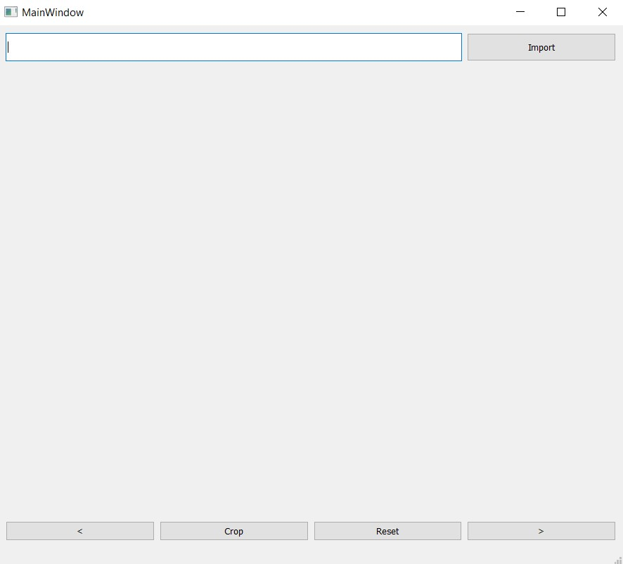

<!-- Topic -->
## Pdf Splitter

A simple pdf splitter purely based on Python 3.9.

<!-- GETTING STARTED -->
## Getting Started

This is just a simple python script, you do not need to install any execute file. Just make sure you have the following:
* Python (preferred python 3.9, havent test on the compatibility)
* PyQt5  (version 5.15.4)
* PyMuPDF(version 1.21.0)
* PyPDF2 (version 2.11.2)

### Prerequisites

Follow the code below if you need to install the above libraries.
* Python:
 
 Just install it from the official Python page.
* PyQt5
  ```sh
  pip install pyqt5
  ```
* PyMuPDF
  ```sh
  pip install PyMuPDF
  ```
* PyPDF2
  ```sh
  pip install PyPDF2[full]
  ```
  
  After all of that, you can type 
    ```sh
  pip list
  ```
  to check you indeed install all the libraries we need.

Also, remember to clone this project to your local machine. You may need to preserve the whole folder (i.e. do not move anything) for the script to work fine.

After all that, you can try running the script. Just double click on the Cropper.py. If everything is fine, the following interface will show up:



If you see this, you are good to go!

<!-- USAGE EXAMPLES -->
## Usage

It is easy to use the script. Just follow the following steps:

1) Put your file in the same directory as the script (Cropper.py)
2) Run the script (Just double click it should do the job)
2) Type the name of your pdf into the textfield(For example, example.pdf)
3) Click Import
4) Click on the section that you want to split the pdf.
5) Click Crop after you have done splitting the pdf.
6) The result of the splitting will be shown in the result folder.

You can find two file in the result folder, 
### 1) File_Name + page_number + merge.pdf (Example: example0_merge.pdf)

This is a pdf file where each splitted section is merged with a blank a4 page and form into a new page.

For example: 

#### example.pdf
* section 1
* section 2
* section 3

#### example0_merge.pdf

page1
* section1
* a4 page

page2
* section2
* a4 page

page3
* section3
* a4 page

### 2) File_Name + page_number + sep.pdf (Example: example0_sep.pdf)

This is a pdf file where each splitted section is append with a blank a4 page. 

For example: 

#### example.pdf
* section 1
* section 2
* section 3

#### example0_sep.pdf

page1
* section 1

page2
* blank page

page3
* section 2

page4
* blank page
...


<p align="right">(<a href="#readme-top">back to top</a>)</p>
